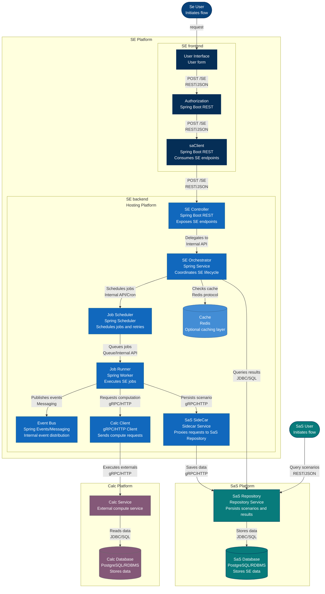
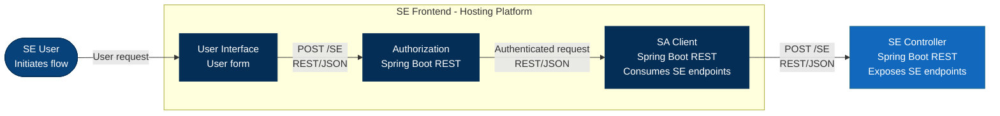

# SE Platform Flow Documentation

This document provides a comprehensive view of the SE (Simulation Engine) platform architecture and data flow, showing both the high-level system overview and detailed frontend component interactions.

## Table of Contents
- [Overview](#overview)
- [Architecture Diagrams](#architecture-diagrams)
  - [Level 3: Complete System Flow](#level-3-complete-system-flow)
  - [Level 4: Frontend Detail](#level-4-frontend-detail)
- [Component Descriptions](#component-descriptions)
- [Integration Points](#integration-points)

---

## Overview

The SE Platform is a distributed system that orchestrates simulation workflows across multiple services:
- **SE Frontend**: User-facing interface and authentication layer
- **SE Backend**: Core orchestration, scheduling, and job execution
- **Calc Platform**: External computation service
- **SaS Platform**: Scenario and result persistence repository

---

## Architecture Diagrams

### Level 3: Complete System Flow

This diagram shows the complete SE platform including all major components, external systems, and data flows.

**Source**: [`se-flow-lvl-3.mmd`](se-flow-lvl-3.mmd)

---

### Level 4: Frontend Detail

This diagram provides a detailed landscape view of the SE Frontend components and their immediate interactions with the backend API.

**Source**: [`se-frontend-flow.mmd`](se-frontend-flow.mmd)

---

## Component Descriptions

### SE Frontend Components

| Component | Technology | Responsibility |
|-----------|-----------|----------------|
| **User Interface** | User form | Presents SE request forms and displays results to end users |
| **Authorization** | Spring Boot REST | Validates user credentials and enforces access control |
| **SA Client** | Spring Boot REST | Acts as REST client to consume SE backend endpoints |

### SE Backend Components

| Component | Technology | Responsibility |
|-----------|-----------|----------------|
| **SE Controller** | Spring Boot REST | Exposes REST API endpoints for SE operations |
| **SE Orchestrator** | Spring Service | Coordinates the complete SE lifecycle and workflow |
| **Job Scheduler** | Spring Scheduler | Manages job scheduling, retry logic, and cron-based triggers |
| **Job Runner** | Spring Worker | Executes queued SE jobs asynchronously |
| **Calc Client** | gRPC/HTTP Client | Communicates with external Calc service for computations |
| **SaS SideCar** | Sidecar Service | Proxies and manages requests to SaS Repository |
| **Event Bus** | Spring Events/Messaging | Distributes internal events across components |
| **Cache** | Redis | Provides optional caching layer for performance optimization |

### External Systems

| System | Technology | Purpose |
|--------|-----------|---------|
| **Calc Service** | External compute service | Performs intensive computations |
| **Calc Database** | PostgreSQL/RDBMS | Stores calculation-related data |
| **SaS Repository** | Repository Service | Persists scenarios and simulation results |
| **SaS Database** | PostgreSQL/RDBMS | Stores all SE scenario and result data |

---

## Integration Points

### Frontend → Backend
- **Protocol**: REST/JSON over HTTP(S)
- **Authentication**: OAuth2/JWT tokens (managed by Authorization component)
- **Primary Endpoints**: 
  - `POST /se` - Submit new simulation request
  - `GET /se/{id}` - Retrieve simulation status/results

### Backend → Calc Platform
- **Protocol**: gRPC or HTTP
- **Purpose**: Offload computationally intensive operations
- **Data Flow**: Job Runner → Calc Client → Calc Service

### Backend → SaS Platform
- **Protocol**: gRPC/HTTP via SaS SideCar
- **Purpose**: Persist scenarios and results for long-term storage and querying
- **Data Flow**: Job Runner → SaS SideCar → SaS Repository → SaS Database

### Caching Strategy
- **Technology**: Redis
- **Usage**: SE Orchestrator checks cache before querying SaS Repository
- **Benefits**: Reduces latency for frequently accessed simulation results

---

## Navigation

- [Back to Mermaid Documentation](c4_readme.md)
- [View Level 3 Diagram Source](se-flow-lvl-3.mmd)
- [View Level 4 Frontend Diagram Source](se-frontend-flow.mmd)
- [Architecture Documentation](../arc42_c4.md)

---

**Last Updated**: February 2026  
**Maintained By**: SE Platform Team

