# 🎨  SE Platform Architecture - Level 2 Detailed View

## ✨ Key Features

### 🏗️ **Architecture Layers**

#### 🌐 **Frontend Layer** (Dark Blue #052E56)
- 📱 User Interface - React/Angular UI with forms and dashboard
- 🔐 Authorization - Spring Security with OAuth2/JWT validation
- 🔌 SA Client - REST consumer for backend integration

#### ⚙️ **Backend Layer** (Blue #1168bd)
- 🎮 SE Controller - @RestController API Gateway
- 🎼 SE Orchestrator - @Service workflow coordinator
- ⏰ Job Scheduler - @Scheduled tasks with cron and retry logic
- 🏃 Job Runner - Async worker for job execution
- 📊 Calc Client - gRPC/HTTP client for computation gateway
- 🚗 SaS SideCar - Proxy service for repository bridge
- 📡 Event Bus - Spring Events message distribution
- 💾 Cache Layer - Redis for performance boost

#### ⚡ **Calc Platform** (Purple #845878)
- 🖥️ Calc Service - Heavy computation external service
- 🗄️ Calc Database - PostgreSQL computation data store

#### 🗂️ **SaS Platform** (Teal #087b7b)
- 📦 SaS Repository - @Repository layer data persistence
- 🗃️ SaS Database - PostgreSQL scenarios and results store

### 🔄 **Data Flow Visualization**

All relationships are enhanced with:
- **Action Emojis**: Visual indicators for operation types (🚀, 📤, ✅, 🔗, etc.)
- **Protocol Labels**: Clear indication of communication protocols (REST/JSON, gRPC/HTTP, JDBC/SQL)
- **Descriptive Text**: Human-readable action descriptions

## 📊 Diagram Source

```mermaid
flowchart TB
%% ============================================================================
%% SE PLATFORM ARCHITECTURE - LEVEL 2 DETAILED VIEW
%% ============================================================================
%% Modern, professional styling with enhanced visual hierarchy
%% ============================================================================

%% Define professional color palette with gradients and shadows
    classDef frontendPallete fill:#052E56,stroke:#0a4d8c,stroke-width:3px,color:#fff,stroke-dasharray:0,rx:10,ry:10
    classDef personSe fill:#08427b,stroke:#0a4d8c,stroke-width:4px,color:#fff,rx:15,ry:15,font-weight:bold
    classDef sasPallete fill:#087b7b,stroke:#0a9c9c,stroke-width:3px,color:#fff,rx:10,ry:10
    classDef container fill:#1168bd,stroke:#1a8fff,stroke-width:3px,color:#fff,rx:10,ry:10
    classDef database fill:#438dd5,stroke:#5ca3e6,stroke-width:3px,color:#fff,rx:10,ry:10
    classDef external fill:#845878,stroke:#a56f93,stroke-width:3px,color:#fff,rx:10,ry:10
    classDef platformBox fill:#f8f9fa,stroke:#495057,stroke-width:4px,color:#212529,rx:15,ry:15
    classDef sectionBox fill:#e9ecef,stroke:#6c757d,stroke-width:3px,color:#212529,rx:12,ry:12

%% ============================================================================
%% ACTORS & USERS
%% ============================================================================
    user([🎯 SE User<br/>━━━━━━━━<br/>Initiates Simulation<br/>Request]):::personSe
%% ============================================================================
%% SE PLATFORM - INTERNAL ARCHITECTURE
%% ============================================================================
    subgraph sePlatform["🏢 SE PLATFORM - Simulation Engine Core"]
        
        subgraph seFrontend["🌐 SE FRONTEND | Presentation Layer"]
            UI["📱 User Interface<br/>━━━━━━━━<br/>React/Angular UI<br/>User Forms & Dashboard"]:::frontendPallete
            authZ["🔐 Authorization<br/>━━━━━━━━<br/>Spring Security<br/>OAuth2/JWT Validation"]:::frontendPallete
            saClient["🔌 SA Client<br/>━━━━━━━━<br/>REST Consumer<br/>Backend Integration"]:::frontendPallete
        end

        subgraph seBackend["⚙️ SE BACKEND | Business Logic Layer"]
            apiController["🎮 SE Controller<br/>━━━━━━━━<br/>@RestController<br/>API Gateway"]:::container
            orchestrator["🎼 SE Orchestrator<br/>━━━━━━━━<br/>@Service Layer<br/>Workflow Coordinator"]:::container
            jobScheduler["⏰ Job Scheduler<br/>━━━━━━━━<br/>@Scheduled Tasks<br/>Cron & Retry Logic"]:::container
            jobRunner["🏃 Job Runner<br/>━━━━━━━━<br/>Async Worker<br/>Job Executor"]:::container
            calcClient["📊 Calc Client<br/>━━━━━━━━<br/>gRPC/HTTP Client<br/>Computation Gateway"]:::container
            sasSideCar["🚗 SaS SideCar<br/>━━━━━━━━<br/>Proxy Service<br/>Repository Bridge"]:::container
            eventBus["📡 Event Bus<br/>━━━━━━━━<br/>Spring Events<br/>Message Distribution"]:::container
            cache[("💾 Cache Layer<br/>━━━━━━━━<br/>Redis<br/>Performance Boost")]:::database
        end
    end


%% ============================================================================
%% EXTERNAL SYSTEMS - CALC PLATFORM
%% ============================================================================
    subgraph calcSection["⚡ CALC PLATFORM | Computation Engine"]
        calcServer["🖥️ Calc Service<br/>━━━━━━━━<br/>Heavy Computation<br/>External Service"]:::external
        calcDb[("🗄️ Calc Database<br/>━━━━━━━━<br/>PostgreSQL<br/>Computation Data")]:::external
    end

%% ============================================================================
%% EXTERNAL SYSTEMS - SaS PLATFORM
%% ============================================================================
    userSas([👤 SaS User<br/>━━━━━━━━<br/>Queries Scenarios<br/>& Results]):::sasPallete
    
    subgraph sasSection["🗂️ SaS PLATFORM | Scenario Repository"]
        sasRepo["📦 SaS Repository<br/>━━━━━━━━<br/>@Repository Layer<br/>Data Persistence Service"]:::sasPallete
        sasDb[("🗃️ SaS Database<br/>━━━━━━━━<br/>PostgreSQL<br/>Scenarios & Results")]:::sasPallete
    end


%% ============================================================================
%% DATA FLOWS & RELATIONSHIPS
%% ============================================================================

%% Frontend Flow
    user -->|"🚀 Submit Request"| UI
    UI -->|"📤 POST /se<br/>REST/JSON"| authZ
    authZ -->|"✅ Authenticated<br/>REST/JSON"| saClient
    saClient -->|"🔗 POST /se<br/>REST/JSON"| apiController

%% Backend Orchestration Flow
    apiController -->|"📞 Delegate to<br/>Service Layer"| orchestrator
    orchestrator -->|"⏱️ Schedule Jobs<br/>Cron/API"| jobScheduler
    orchestrator -->|"🔍 Check Cache<br/>Redis Protocol"| cache
    orchestrator -->|"📋 Query Results<br/>JDBC/SQL"| sasRepo

%% Job Execution Flow
    jobScheduler -->|"📨 Queue Jobs<br/>Internal Queue"| jobRunner
    jobRunner -->|"📢 Publish Events<br/>Spring Events"| eventBus
    jobRunner -->|"🧮 Request Compute<br/>gRPC/HTTP"| calcClient
    jobRunner -->|"💾 Persist Scenario<br/>gRPC/HTTP"| sasSideCar

%% External Integration Flow
    calcClient -->|"⚙️ Execute Computation<br/>gRPC/HTTP"| calcServer
    calcServer -->|"📖 Read Data<br/>JDBC/SQL"| calcDb
    sasSideCar -->|"💿 Save Data<br/>gRPC/HTTP"| sasRepo
    sasRepo -->|"📝 Store Data<br/>JDBC/SQL"| sasDb

%% Direct SaS Access
    userSas -->|"🔎 Query Scenarios<br/>REST/JSON"| sasRepo
```

## 🎨 Color Palette

| Component Type | Fill Color | Stroke Color | Purpose |
|---------------|------------|--------------|---------|
| **Frontend** | `#052E56` | `#0a4d8c` | Dark blue for presentation layer |
| **User/Person** | `#08427b` | `#0a4d8c` | Medium blue for actors |
| **Backend Container** | `#1168bd` | `#1a8fff` | Bright blue for business logic |
| **Database** | `#438dd5` | `#5ca3e6` | Light blue for data stores |
| **SaS Platform** | `#087b7b` | `#0a9c9c` | Teal for scenario repository |
| **External Systems** | `#845878` | `#a56f93` | Purple for external dependencies |

## 🚀 Design Principles Applied

1. **Visual Hierarchy**: Stronger borders (3-4px) on important components
2. **Consistent Spacing**: Unicode separators for clean section breaks
3. **Icon Language**: Emojis provide instant component recognition
4. **Color Psychology**: 
   - Blue tones = Trust, stability (internal systems)
   - Purple = External/premium services
   - Teal = Data persistence
5. **Typography**: Multi-line labels with clear technology stack indicators
6. **Accessibility**: High contrast text on all backgrounds

## 📝 Usage Notes

- View this diagram in any Mermaid-compatible renderer (GitHub, GitLab, IntelliJ IDEA, VS Code with Mermaid extension)
- Export to PNG/SVG for presentations using Mermaid CLI or online editors
- Ideal for architecture documentation, onboarding materials, and technical presentations

## 🔗 Related Documentation

- [Complete Flow Documentation](se-flow-documentation.md)
- [Level 3 System Flow](se-flow-lvl-3.mmd)
- [Frontend Detail View](se-frontend-flow.mmd)
- [C4 Model Diagrams](../SE-C4-diag/)

---

**Last Updated**: February 2026  
**Design**: Professional Mermaid Architecture Diagram  
**Maintained By**: SE Platform Team

