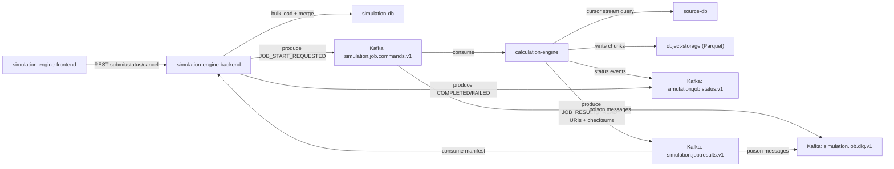

# Kafka Architecture Proposal for Simulation Use Case

## Goal

Design a Kafka-first event architecture for this flow:

1. `simulation-engine-frontend` submits a simulation request.
2. `simulation-engine-backend` validates request and starts orchestration.
3. `calculation-engine` reads source DB, computes data (`~1,000,000 rows x 50 columns`).
4. `simulation-engine-backend` persists final dataset to its own DB.

## Architecture Summary

- Use **REST/gRPC only for user-facing command/control** (submit/status/cancel).
- Use **Kafka for asynchronous orchestration and state transitions**.
- Use **object storage for large result payloads** (Parquet files), and publish only references in Kafka events.
- Use **idempotent producers + idempotent consumers** to tolerate retries and at-least-once delivery.

## Why Kafka Fits This Use Case

- Job lifecycle is long-running and asynchronous.
- Multiple services need decoupling and independent scaling.
- Events like `started/progress/completed/failed` may have multiple consumers (UI updates, audit, alerts, analytics).
- Large data should not flow inline over RPC; Kafka events should carry metadata and URIs, not full result rows.

## Components

- `simulation-engine-frontend` (API client/UI)
- `simulation-engine-backend` (orchestrator + persistence coordinator)
- `calculation-engine` (heavy compute + source DB extraction)
- `source-db` (read-only source)
- `object-storage` (S3/MinIO for result files)
- `simulation-db` (target persisted data)
- `kafka cluster` + schema registry

## Topic Design

Use versioned topics and explicit ownership:

1. `simulation.job.commands.v1`
- Producer: simulation backend
- Consumer: calculation engine
- Key: `jobId`
- Purpose: start/cancel commands

2. `simulation.job.status.v1`
- Producer: calculation engine, simulation backend
- Consumers: backend, notification service, monitoring
- Key: `jobId`
- Purpose: lifecycle updates (`ACCEPTED`, `RUNNING`, `PERSISTING`, `COMPLETED`, `FAILED`, `CANCELLED`)

3. `simulation.job.results.v1`
- Producer: calculation engine
- Consumer: simulation backend
- Key: `jobId`
- Purpose: result manifest with URIs/checksums/row counts

4. `simulation.job.dlq.v1`
- Producer: any consumer that exhausts retries
- Consumer: operations/remediation job
- Purpose: dead-lettered messages with error metadata

## Event Schemas

Prefer Protobuf or Avro with schema registry. Include these common fields in every event:

- `eventId` (UUID)
- `eventType`
- `eventVersion`
- `occurredAt` (UTC ISO-8601)
- `jobId`
- `systemId`
- `traceId`

### Start Command Example (`simulation.job.commands.v1`)

```json
{
  "eventId": "0a5c2e72-d889-4fb4-a68a-c7bfa5f8ec72",
  "eventType": "JOB_START_REQUESTED",
  "eventVersion": "1",
  "occurredAt": "2026-03-07T22:30:00Z",
  "jobId": "job-9f1b",
  "systemId": "sys-12345",
  "traceId": "trc-8a4f",
  "parameters": {
    "scenario": "baseline",
    "from": "2026-01-01",
    "to": "2026-01-31"
  },
  "resultSpec": {
    "format": "PARQUET",
    "compression": "SNAPPY",
    "targetChunkMb": 256
  }
}
```

### Result Manifest Example (`simulation.job.results.v1`)

```json
{
  "eventId": "3319ab5d-f7f9-4e9f-82df-43ee8f471f14",
  "eventType": "JOB_RESULTS_READY",
  "eventVersion": "1",
  "occurredAt": "2026-03-07T22:41:12Z",
  "jobId": "job-9f1b",
  "systemId": "sys-12345",
  "traceId": "trc-8a4f",
  "rowCount": 1000000,
  "columnCount": 50,
  "schemaVersion": "2026-03-01",
  "files": [
    {
      "uri": "s3://calc-results/job-9f1b/part-0001.parquet",
      "rows": 250000,
      "checksum": "sha256:..."
    },
    {
      "uri": "s3://calc-results/job-9f1b/part-0002.parquet",
      "rows": 250000,
      "checksum": "sha256:..."
    }
  ]
}
```

## Partitioning Strategy

- Primary key for job lifecycle topics: `jobId` (ensures in-order events per job).
- If multi-tenant ordering matters across jobs for same system, choose `systemId` key.
- Recommended initial partition count: `12-48` based on throughput and consumer parallelism.
- Replication factor: `3` for production durability.

## Consumer Groups

- `calc-engine-workers` consumes `simulation.job.commands.v1`.
- `sim-backend-results` consumes `simulation.job.results.v1`.
- `sim-backend-status` consumes `simulation.job.status.v1`.
- Optional: `analytics-consumers`, `audit-consumers`, `notification-consumers`.

Each group scales independently without changing producers.

## Reliability and Delivery Rules

1. Producer settings
- `acks=all`
- `enable.idempotence=true`
- bounded retries with backoff

2. Consumer processing
- Manual offset commit after successful processing
- Deduplicate by `eventId` (or `(jobId,eventType,sequence)`)
- Persist processing state in DB table `processed_events`

3. Retry and DLQ
- Retry transient errors with exponential backoff
- On retry exhaustion, publish envelope + cause to `simulation.job.dlq.v1`

4. Ordering
- Keep all events for same key in one partition
- Avoid repartitioning keys mid-flow

5. Payload limits
- Keep event payload small (`<1 MB`)
- Never publish million-row data directly to Kafka

## Data Path for 1,000,000 x 50 Result

1. Calculation engine streams from source DB using cursor.
2. Writes chunked Parquet files to object storage.
3. Publishes `JOB_RESULTS_READY` manifest event.
4. Simulation backend consumes manifest and bulk-loads to staging table.
5. Transactional merge/upsert to target tables in `simulation-db`.
6. Emits `COMPLETED` status event.

## State Machine

`REQUESTED -> ACCEPTED -> RUNNING -> RESULTS_READY -> PERSISTING -> COMPLETED`

Error/cancel transitions:
- `* -> FAILED`
- `REQUESTED/ACCEPTED/RUNNING -> CANCELLING -> CANCELLED`

## Observability Specification

Track at minimum:

- `consumer_lag` per topic/partition/group
- message processing latency (`occurredAt` to process time)
- retry count and DLQ volume
- failed/duplicate event rate
- job duration by state
- persistence throughput (rows/sec)

Correlate logs/metrics/traces by `traceId`, `jobId`, and `systemId`.

## Security and Governance

- mTLS + SASL for Kafka client auth.
- ACLs per topic (least privilege).
- Schema compatibility mode: backward-compatible.
- Encrypt object-storage buckets and enforce signed URL expiry.
- PII policy: no sensitive raw row content inside events.

## Minimal Implementation Plan

1. Define schemas for `commands/status/results`.
2. Create topics with partition/retention/replication policy.
3. Implement command producer in simulation backend.
4. Implement calculation engine consumer + result writer + manifest producer.
5. Implement simulation backend result consumer + bulk persist pipeline.
6. Add dedup table and DLQ handler.
7. Add lag/retry/error dashboards and alerts.

## Mermaid Diagram



## Recommendation

Adopt a **hybrid control + event** approach:
- Keep synchronous API ingress at backend (REST/gRPC).
- Use Kafka as the workflow backbone and integration bus.
- Use object storage manifests for large datasets.
- Enforce idempotency, schema governance, and DLQ from day one.
